# Process diagrams

Flowcharts of each process in boekpilot. All agents are **read-only by default** — the `--book`
branches only run when you pass that flag.

## Architecture / data flow

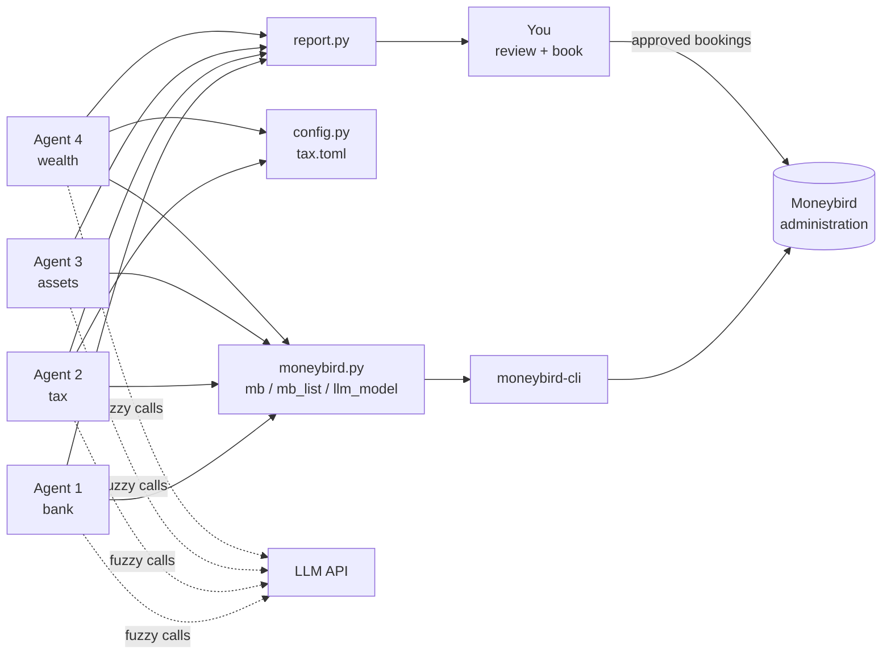

## Agent 1 — bank classification

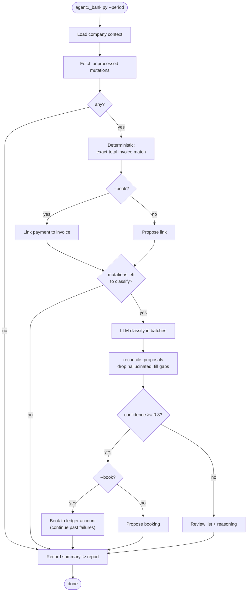

## Agent 2 — tax (accruals, hours criterion, deductions)

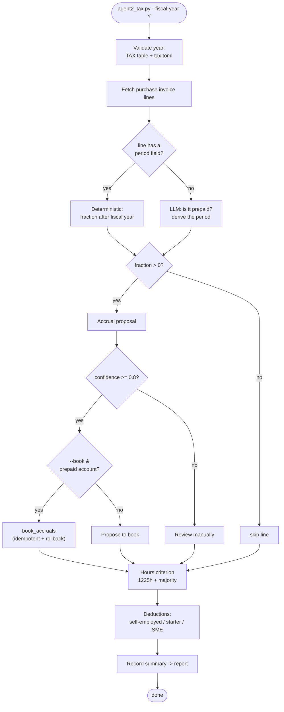

## Agent 3 — assets (capitalization, KIA, disposals)

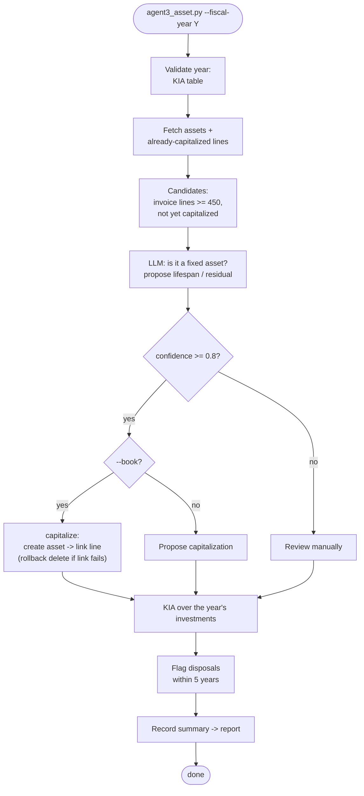

## Agent 4 — wealth (annual margin, annuity)

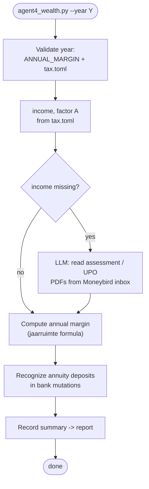

## Shared — paginated reads (`mb_list`)

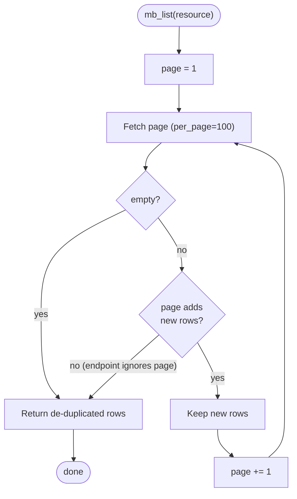

## Shared — accrual booking safety (`book_accruals`)

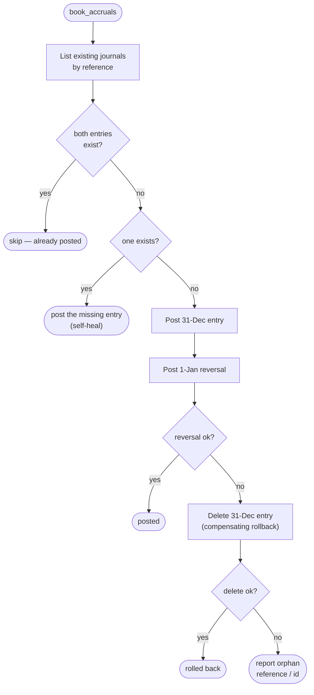

## Scheduled weekly run + report (`run_weekly.sh` + `report.py`)

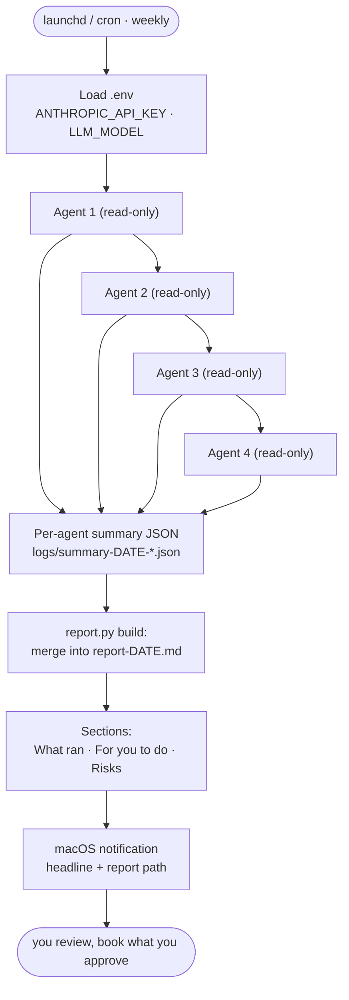

## Write-safety model (`--book`)

How any proposal reaches (or doesn't reach) your books.

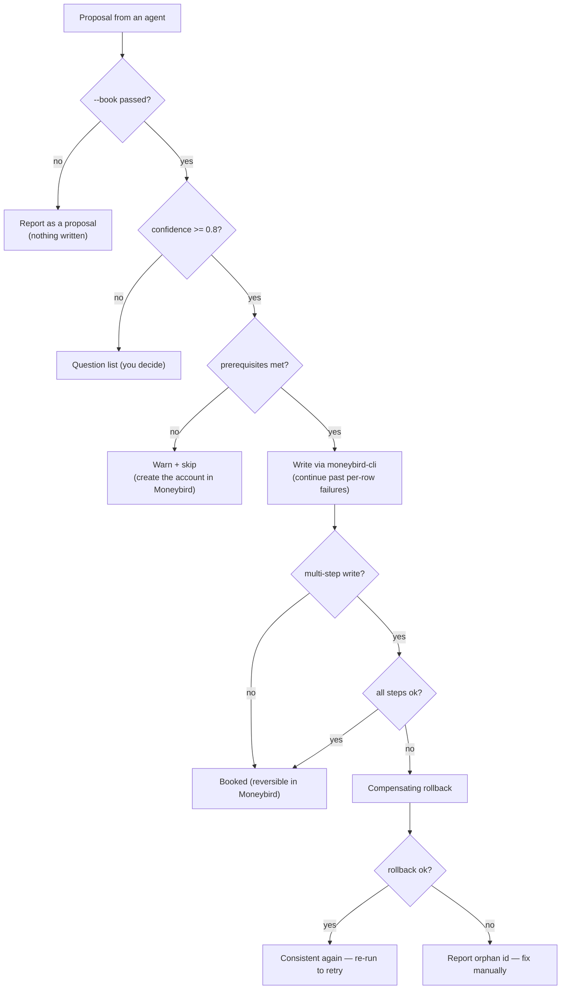

## API call ordering (sequence diagrams)

### Agent 1 — read, classify, and (optionally) book

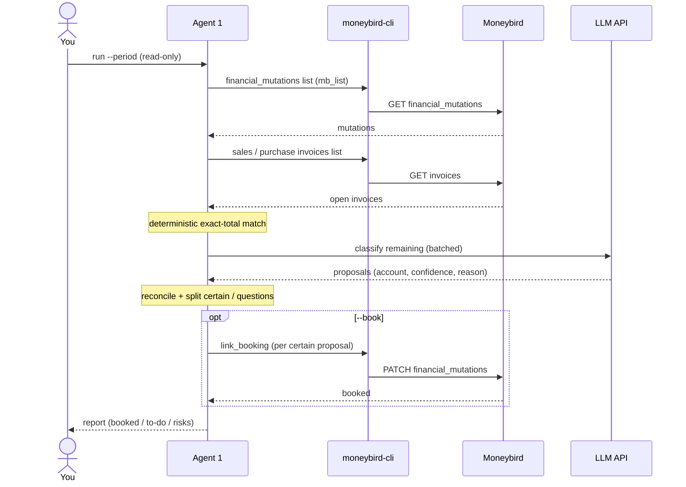

### Accrual booking with rollback (`book_accruals`)

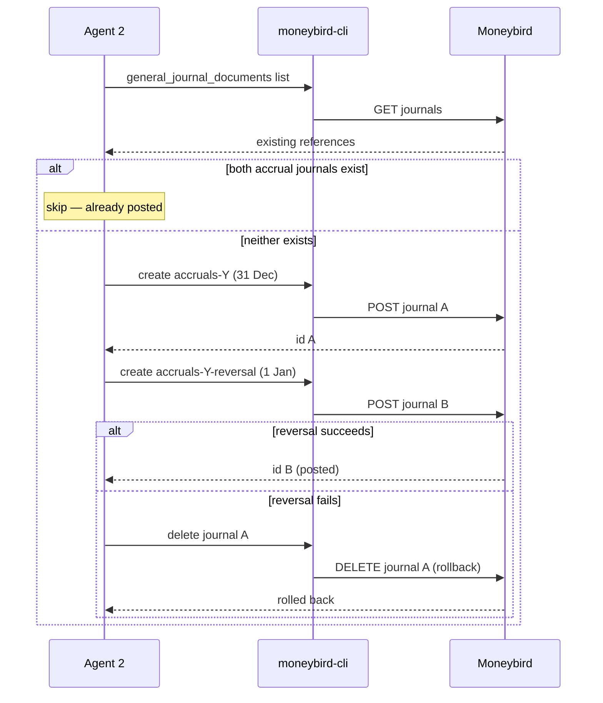
